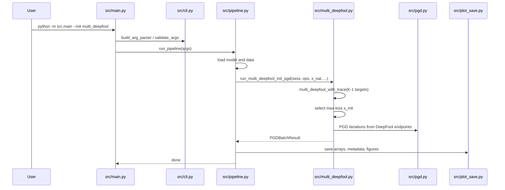
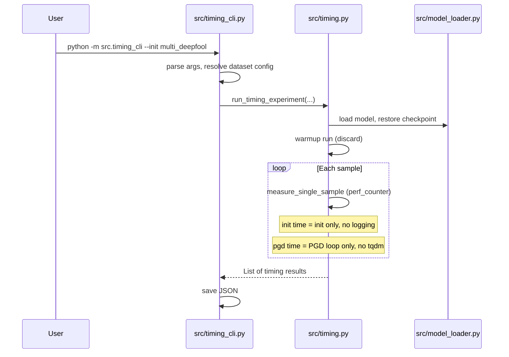
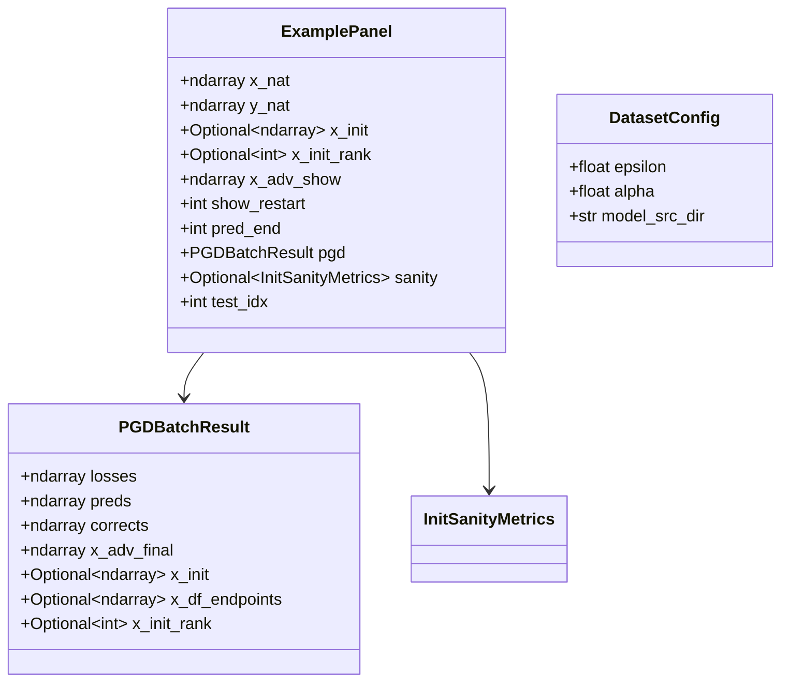

# Technical Design: codebase-consolidation

## Overview

**Purpose**: PGD 攻撃評価プロジェクトのコードベースを統合・リファクタリングし，レガシースクリプト（`loss_curves.py`, `measure_timing.py`）のロジックを `src/` パッケージに集約する．

**Users**: 研究者が単一エントリポイント `src/main.py` から全初期化手法（random, deepfool, multi_deepfool, clean）を実行し，タイミング計測・分析を簡潔なコマンドで行える環境を提供する．

**Impact**: `loss_curves.py` と `measure_timing.py` を削除し，コード重複を排除する．分析スクリプトのパラメータ自動解決を導入し，バッチスクリプトを `src/main.py` に一本化する．

### Goals
- Multi-DeepFool 初期化を `src/` パッケージに統合し，`--init multi_deepfool` で実行可能にする
- 実行時間計測を `src/timing.py` に統合し，計測精度を維持する
- 分析スクリプトのデータセットパラメータ自動解決を実装する
- コード重複を排除し，モジュール間の依存を一方向に保つ
- ベストエフォートでテストスイートを拡充する

### Non-Goals
- PGD アルゴリズムの改良や新しい攻撃手法の追加
- TF 2.x への移行
- Singularity コンテナの構成変更
- 分析スクリプトの可視化手法の変更（ヒートマップ・LaTeX テーブルのレイアウト等）

## Architecture

### Existing Architecture Analysis

現在のアーキテクチャは CLI ベースのパイプライン構成で，`src/` パッケージにコアロジックが分離されている．ただし以下の課題がある:

- `loss_curves.py`（約 1549 行）が `src/` と完全に重複した DTO・ユーティリティ・モデルロード・PGD 実行を持ち，Multi-DeepFool 固有ロジックのみが追加されている
- `measure_timing.py` が DTO・ユーティリティ・モデルロード・PGD を独自実装しており，計測精度のために tqdm やログを排除した軽量版
- `src/cli.py` の `--init` 選択肢に `multi_deepfool` がなく，`loss_curves.py` を別途実行する必要がある
- バッチスクリプトが `src/main.py`（random, deepfool, clean）と `loss_curves.py`（multi_deepfool）を混在使用

### Architecture Pattern & Boundary Map

```mermaid
graph TB
    subgraph EntryPoints
        MainPy[src/main.py]
        TimingCli[src/timing_cli.py]
        FindCommon[find_common_correct_samples.py]
        AnalyzeMis[analyze_misclassification.py]
        AnalyzeTim[analyze_timing.py]
    end

    subgraph CorePipeline
        Pipeline[src/pipeline.py]
        PGD[src/pgd.py]
        DeepFool[src/deepfool.py]
        MultiDF[src/multi_deepfool.py]
        Timing[src/timing.py]
    end

    subgraph SharedModules
        CLI[src/cli.py]
        DTO[src/dto.py]
        MathUtils[src/math_utils.py]
        ModelLoader[src/model_loader.py]
        DataLoader[src/data_loader.py]
        DatasetCfg[src/dataset_config.py]
        LogConfig[src/logging_config.py]
    end

    subgraph Visualization
        PlotPanel[src/plot_panel.py]
        PlotSetup[src/plot_setup.py]
        PlotSanity[src/plot_sanity.py]
        PlotSave[src/plot_save.py]
    end

    subgraph BatchScripts
        RunAll[run_all_ex100.sh]
        RunTiming[run_timing_ex100.sh]
    end

    MainPy --> CLI
    MainPy --> Pipeline
    TimingCli --> Timing
    TimingCli --> CLI

    Pipeline --> PGD
    Pipeline --> DeepFool
    Pipeline --> MultiDF
    Pipeline --> PlotPanel
    Pipeline --> PlotSave

    PGD --> DTO
    PGD --> MathUtils
    DeepFool --> DTO
    DeepFool --> MathUtils
    MultiDF --> DTO
    MultiDF --> MathUtils
    Timing --> DTO
    Timing --> MathUtils

    Pipeline --> ModelLoader
    Pipeline --> DataLoader
    Timing --> ModelLoader
    Timing --> DataLoader

    FindCommon --> ModelLoader
    FindCommon --> DataLoader
    FindCommon --> DTO
    AnalyzeMis --> DatasetCfg
    AnalyzeTim --> DatasetCfg

    DatasetCfg --> DTO

    RunAll --> MainPy
    RunTiming --> TimingCli
end
```

**Architecture Integration**:
- Selected pattern: パイプライン指向のフラット構造（既存パターンを維持）
- Domain/feature boundaries: コアパイプライン / 計測 / 分析 / 可視化の 4 領域
- Existing patterns preserved: 1 ファイル = 1 責務，DTO パターン，一方向依存
- New components rationale: `src/multi_deepfool.py`（Multi-DeepFool 固有ロジック），`src/timing.py`（計測専用軽量コードパス），`src/dataset_config.py`（パラメータ一元管理），`src/timing_cli.py`（計測用エントリポイント）
- Steering compliance: `structure.md` の依存方向規則に準拠

### Technology Stack

| Layer | Choice / Version | Role in Feature | Notes |
|-------|------------------|-----------------|-------|
| CLI | Python argparse | CLI 引数解析・バリデーション | 既存パターンを維持 |
| Backend | Python 3.6.9+ / TF 1.15.5 | PGD 攻撃・DeepFool・計測 | `tf.compat.v1` Session API |
| Data | NumPy / JSON / .npy | 配列保存・計測結果・共通インデックス | 既存フォーマット維持 |
| Testing | pytest | ユニットテスト・TF 依存テストのスキップ | `pytest.mark.skipif` |
| Batch | bash | 実験パラメータ管理・一括実行 | 変数による一元管理 |

## System Flows

### Multi-DeepFool 初期化付き PGD パイプライン



### タイミング計測フロー



## Requirements Traceability

| Requirement | Summary | Components | Interfaces | Flows |
|-------------|---------|------------|------------|-------|
| 1.1 | `--init multi_deepfool` で MDF 実行 | src/multi_deepfool.py, src/pipeline.py | `run_multi_deepfool_init_pgd` | MDF PGD パイプライン |
| 1.2 | CLI に `multi_deepfool` 追加 | src/cli.py | `build_arg_parser` | - |
| 1.3 | `multi_deepfool_with_trace` / `run_multi_deepfool_init_pgd` 提供 | src/multi_deepfool.py | 関数シグネチャ | MDF PGD パイプライン |
| 1.4 | 全初期化手法を単一エントリポイントから実行 | src/main.py, src/cli.py | `build_arg_parser` | - |
| 1.5 | `loss_curves.py` をレガシーとして削除 | - | - | - |
| 1.6 | 同一出力配列フォーマット | src/multi_deepfool.py, src/dto.py | `PGDBatchResult` | - |
| 2.1 | タイミング計測を `src/` 内モジュールとして提供 | src/timing.py | `run_timing_experiment`, `measure_single_sample` | タイミング計測 |
| 2.2 | 共通モジュール再利用 | src/timing.py | dto, data_loader, model_loader, math_utils | - |
| 2.3 | `measure_timing.py` 削除 | - | - | - |
| 2.4 | タイミング CLI 引数 | src/timing_cli.py | `build_timing_arg_parser` | - |
| 2.5 | JSON 形式出力 | src/timing_cli.py | JSON output | - |
| 2.6 | ウォームアップ実行 | src/timing.py | `run_timing_experiment` | タイミング計測 |
| 2.7 | 計測対象外処理を含まない | src/timing.py | `run_pgd_timing`, init functions | - |
| 2.8 | 計測専用軽量コードパス | src/timing.py | `run_pgd_timing`, `random_init_timing`, `deepfool_init_timing`, `multi_deepfool_init_timing` | - |
| 2.9 | 通常/計測モード切り替え | src/timing_cli.py（独立エントリポイント） | - | - |
| 3.1 | パラメータ自動解決 | src/dataset_config.py | `resolve_dataset_config` | - |
| 3.2 | `find_common_correct_samples.py` が共通モジュール再利用 | find_common_correct_samples.py | src.data_loader, src.model_loader, src.dto | - |
| 3.3 | `analyze_misclassification.py` 実験名自動推定 | analyze_misclassification.py | - | - |
| 3.4 | `analyze_timing.py` 実験名自動推定 | analyze_timing.py | - | - |
| 3.5 | 入力ファイル不在時のエラーメッセージ | 各分析スクリプト | - | - |
| 3.6 | `--help` 表示 | 各分析スクリプト | argparse | - |
| 4.1 | バッチスクリプトが `src/main.py` を使用 | run_all_ex100.sh | - | - |
| 4.2 | 全初期化手法を単一エントリポイント経由 | run_all_ex100.sh | src/main.py | - |
| 4.3 | 共通パラメータ一元管理 | run_all_ex100.sh | shell variables | - |
| 4.4 | タイムスタンプ付きログ | run_all_ex100.sh, run_timing_ex100.sh | - | - |
| 4.5 | 統合後タイミングモジュール使用 | run_timing_ex100.sh | src/timing_cli.py | - |
| 5.1 | DTO 一元定義 | src/dto.py | `ModelOps`, `PGDBatchResult`, `ExamplePanel`, `DatasetConfig` | - |
| 5.2 | 数学ユーティリティ一元定義 | src/math_utils.py | `clip_to_unit_interval`, `project_linf`, `linf_distance` | - |
| 5.3 | モデルロード一元定義 | src/model_loader.py | `load_model_module`, `instantiate_model`, `create_tf_session`, `restore_checkpoint` | - |
| 5.4 | `loss_curves.py` の重複削除 | - | - | - |
| 5.5 | `measure_timing.py` の重複削除 | - | - | - |
| 5.6 | 一方向依存の維持 | 全モジュール | 依存グラフ | - |
| 6.1 | TF 依存部分を含むテスト | tests/ | pytest | - |
| 6.2 | TF 不可時の自動スキップ | tests/conftest.py | `pytest.mark.skipif` | - |
| 6.3 | Multi-DeepFool TF 非依存テスト | tests/test_multi_deepfool.py | `compute_perturbation_to_target` | - |
| 6.4 | 分析スクリプトのテスト | tests/test_analyze_misclassification.py, tests/test_analyze_timing.py | parse, stats functions | - |
| 6.5 | `pytest tests/` で実行 | tests/ | - | - |
| 6.6 | CLI テスト | tests/test_cli.py | - | - |
| 6.7 | ベストエフォート | - | - | - |
| 7.1 | 同一ディレクトリ構造 | src/pipeline.py, src/plot_save.py | `arrays/`, `figures/`, `metadata/` | - |
| 7.2 | 同一ファイル命名規則 | src/cli.py, src/plot_save.py | `{dataset}_{model}_{init}_p{n}_losses.npy` | - |
| 7.3 | `*_corrects.npy` 互換 | src/plot_save.py | - | - |
| 7.4 | タイミング JSON 互換 | src/timing_cli.py | JSON format | - |
| 7.5 | メタデータに MDF パラメータ含む | src/plot_save.py, src/pipeline.py | `df_max_iter`, `df_overshoot` | - |

## Components and Interfaces

| Component | Domain/Layer | Intent | Req Coverage | Key Dependencies (P0/P1) | Contracts |
|-----------|--------------|--------|--------------|--------------------------|-----------|
| src/multi_deepfool.py | Core Pipeline | Multi-DeepFool 初期化と PGD 統合実行 | 1.1, 1.3, 1.6 | src/dto.py (P0), src/math_utils.py (P0) | Service |
| src/timing.py | Timing | 計測専用の軽量初期化・PGD コードパス | 2.1, 2.2, 2.6, 2.7, 2.8 | src/dto.py (P0), src/model_loader.py (P0) | Service |
| src/timing_cli.py | Timing / CLI | タイミング計測のエントリポイント | 2.4, 2.5, 2.9, 4.5 | src/timing.py (P0), src/dataset_config.py (P1) | Batch |
| src/dataset_config.py | Shared | データセット固有パラメータの一元管理 | 3.1, 5.1 | - | Service |
| src/cli.py (変更) | Shared / CLI | `--init multi_deepfool` 選択肢追加 | 1.2, 1.4 | - | Service |
| src/dto.py (変更) | Shared | PGDBatchResult フィールド拡張 | 1.6, 5.1 | - | State |
| src/pipeline.py (変更) | Core Pipeline | Multi-DeepFool init ブランチ追加 | 1.1, 7.1, 7.2, 7.5 | src/multi_deepfool.py (P0) | Service |
| src/plot_save.py (変更) | Visualization | MDF メタデータ出力対応 | 7.3, 7.5 | src/dto.py (P0) | Service |
| run_all_ex100.sh (変更) | Batch | `loss_curves.py` -> `src/main.py` に切り替え | 4.1, 4.2, 4.3, 4.4 | src/main.py (P0) | Batch |
| run_timing_ex100.sh (変更) | Batch | `measure_timing.py` -> `src/timing_cli.py` に切り替え | 4.5 | src/timing_cli.py (P0) | Batch |
| tests/conftest.py (変更) | Testing | TF スキップフィクスチャ | 6.2 | pytest (P0) | - |

### Core Pipeline

#### src/multi_deepfool.py

| Field | Detail |
|-------|--------|
| Intent | Multi-DeepFool 初期化による PGD 攻撃の実行 |
| Requirements | 1.1, 1.3, 1.6 |

**Responsibilities & Constraints**
- `loss_curves.py` の Multi-DeepFool 固有ロジックを単一モジュールに集約
- 正解ラベル以外の全ターゲットラベルに対する DeepFool を実行し，(K-1) 個の初期点を生成
- `src/dto.py` の `PGDBatchResult` と同一 shape の出力を生成
- `compute_perturbation_to_target` は `src/deepfool.py` から共有しない（Multi-DeepFool 固有のコンテキストで使用するため）

**Dependencies**
- Inbound: src/pipeline.py -- Multi-DeepFool init 分岐 (P0)
- Outbound: src/dto.py -- PGDBatchResult, ModelOps (P0)
- Outbound: src/math_utils.py -- clip_to_unit_interval, project_linf (P0)
- External: tensorflow 1.15.5 -- Session API (P0)
- External: numpy -- 配列操作 (P0)

**Contracts**: Service [x] / API [ ] / Event [ ] / Batch [ ] / State [ ]

##### Service Interface

```python
def compute_perturbation_to_target(
    f: np.ndarray,
    grads_all: np.ndarray,
    start_label: int,
    target_class: int,
) -> Tuple[np.ndarray, float]:
    """Compute perturbation toward target class from gradients.

    Args:
        f: Logit differences (num_classes,)
        grads_all: Per-class gradients (num_classes, *input_shape)
        start_label: Original predicted class
        target_class: Target class index

    Returns:
        r_flat: Perturbation vector (flattened, float32)
        r_norm: L2 norm of perturbation
    """

def multi_deepfool_with_trace(
    sess: tf.compat.v1.Session,
    ops: ModelOps,
    x0: np.ndarray,
    y_nat: np.ndarray,
    top_k: int,
    max_iter: int,
    overshoot: float,
    eps: float,
) -> Tuple[Tuple[np.ndarray, ...], np.ndarray, np.ndarray]:
    """Multi-DeepFool with trajectory recording.

    Returns:
        x_advs: Tuple of (top_k,) adversarial examples projected to eps-ball
        losses: (top_k, max_iter+1) loss trajectory
        preds: (top_k, max_iter+1) prediction trajectory
    """

def run_multi_deepfool_init_pgd(
    sess: tf.compat.v1.Session,
    ops: ModelOps,
    x_nat: np.ndarray,
    y_nat: np.ndarray,
    eps: float,
    alpha: float,
    total_iter: int,
    num_restarts: int,
    df_max_iter: int,
    df_overshoot: float,
    seed: int,
) -> PGDBatchResult:
    """Run Multi-DeepFool initialization followed by PGD.

    Returns PGDBatchResult with:
        losses: (num_restarts, total_iter+1) -- iter 0 = DeepFool endpoint
        preds: (num_restarts, total_iter+1)
        corrects: (num_restarts, total_iter+1)
        x_adv_final: (num_restarts, *input_shape)
        x_df_endpoints: (num_restarts, *input_shape)
        x_init: (1, *input_shape) -- max-loss DeepFool point
        x_init_rank: int -- index of max-loss restart
    """
```

- Preconditions: `num_restarts <= num_classes - 1` (ターゲット数の制約)
- Postconditions: `losses.shape == (num_restarts, total_iter + 1)`
- Invariants: 全出力が eps-ball 内に射影されている

**Implementation Notes**
- Integration: `src/pipeline.py` の `run_one_example` に `args.init == "multi_deepfool"` ブランチを追加
- Validation: `num_restarts` がクラス数 - 1 を超える場合は `ValueError`
- Risks: `loss_curves.py` との数値的同値性の検証が必要

#### src/timing.py

| Field | Detail |
|-------|--------|
| Intent | 計測精度を維持した軽量タイミング計測ロジック |
| Requirements | 2.1, 2.2, 2.6, 2.7, 2.8 |

**Responsibilities & Constraints**
- `measure_timing.py` の計測ロジックを移行
- 計測対象外の処理（tqdm, 進捗ログ, 配列記録）を一切含まない
- `src/` の共通モジュール（dto, math_utils, model_loader, data_loader）を再利用
- 初期化関数（random, deepfool, multi_deepfool）とPGD ループの計測専用版を提供

**Dependencies**
- Inbound: src/timing_cli.py -- エントリポイント (P0)
- Outbound: src/dto.py -- ModelOps (P0)
- Outbound: src/math_utils.py -- clip_to_unit_interval, project_linf (P0)
- Outbound: src/model_loader.py -- load_model_module, instantiate_model, create_tf_session, restore_checkpoint (P0)
- Outbound: src/data_loader.py -- load_test_data (P0)
- External: tensorflow 1.15.5 -- Session API (P0)
- External: time -- perf_counter (P0)

**Contracts**: Service [x] / API [ ] / Event [ ] / Batch [ ] / State [ ]

##### Service Interface

```python
def random_init_timing(
    rng: np.random.RandomState,
    x_nat_batch: np.ndarray,
    eps: float,
) -> np.ndarray:
    """Random initialization (timing-optimized, no logging)."""

def deepfool_init_timing(
    sess: tf.compat.v1.Session,
    ops: ModelOps,
    x_nat: np.ndarray,
    eps: float,
    max_iter: int,
    overshoot: float,
) -> np.ndarray:
    """DeepFool initialization (timing-optimized, no logging)."""

def multi_deepfool_init_timing(
    sess: tf.compat.v1.Session,
    ops: ModelOps,
    x_nat: np.ndarray,
    eps: float,
    max_iter: int,
    overshoot: float,
    num_targets: int,
) -> np.ndarray:
    """Multi-DeepFool initialization (timing-optimized, no logging)."""

def run_pgd_timing(
    sess: tf.compat.v1.Session,
    ops: ModelOps,
    x_adv: np.ndarray,
    x_nat_batch: np.ndarray,
    y_batch: np.ndarray,
    eps: float,
    alpha: float,
    total_iter: int,
) -> np.ndarray:
    """PGD iterations (timing-optimized, no tqdm/logging/array recording)."""

def measure_single_sample(
    sess: tf.compat.v1.Session,
    ops: ModelOps,
    x_nat: np.ndarray,
    y_nat: np.ndarray,
    init_method: str,
    num_restarts: int,
    eps: float,
    alpha: float,
    total_iter: int,
    df_max_iter: int,
    df_overshoot: float,
    seed: int,
) -> Dict[str, float]:
    """Measure timing for a single sample.

    Returns:
        {"init": float, "pgd": float, "total": float}
    """

def run_timing_experiment(
    dataset: str,
    model_src_dir: str,
    ckpt_dir: str,
    indices: List[int],
    init_method: str,
    num_restarts: int,
    eps: float,
    alpha: float,
    total_iter: int,
    df_max_iter: int,
    df_overshoot: float,
    seed: int,
) -> List[Dict[str, float]]:
    """Run timing experiment with warmup for all samples."""
```

- Preconditions: TF session が有効，チェックポイントがロード済み
- Postconditions: 各計測結果は非負の浮動小数点値
- Invariants: 計測区間に tqdm, LOGGER, 配列書き込み（losses/preds）を含まない

**Implementation Notes**
- Integration: `measure_timing.py` のロジックを移行後，ルートレベルのファイルを削除
- Validation: `init_method` が "random", "deepfool", "multi_deepfool" のいずれかであることを検証
- Risks: `src/` の共通モジュール（model_loader, data_loader）のインポート時オーバーヘッドは計測区間外

### Timing / CLI

#### src/timing_cli.py

| Field | Detail |
|-------|--------|
| Intent | タイミング計測の CLI エントリポイント |
| Requirements | 2.4, 2.5, 2.9, 4.5 |

**Responsibilities & Constraints**
- `measure_timing.py` の `main()` と CLI 引数解析を移行
- `src/dataset_config.py` からパラメータを自動解決
- JSON 形式で計測結果を出力（既存フォーマット互換）
- `python -m src.timing_cli` で実行可能

**Dependencies**
- Outbound: src/timing.py -- run_timing_experiment (P0)
- Outbound: src/dataset_config.py -- resolve_dataset_config (P1)
- External: json -- 結果出力 (P0)

**Contracts**: Service [ ] / API [ ] / Event [ ] / Batch [x] / State [ ]

##### Batch / Job Contract
- Trigger: `python -m src.timing_cli --dataset mnist --model nat --init random ...`
- Input / validation: dataset, model, init, num_restarts, common_indices_file (required); total_iter, df_max_iter, df_overshoot, seed (optional defaults)
- Output / destination: `{out_dir}/timing/{exp_name}/timing_{dataset}_{model}_{init}_n{num_restarts}.json`
- Idempotency & recovery: 同一パラメータで再実行すると上書き

**Implementation Notes**
- Integration: `run_timing_ex100.sh` の `measure_timing.py` 呼び出しを `src/timing_cli.py` に変更
- Risks: CLI 引数の互換性（`--model` でモデル名指定，`--model_src_dir`/`--ckpt_dir` は自動解決）

### Shared Modules

#### src/dataset_config.py

| Field | Detail |
|-------|--------|
| Intent | データセット固有パラメータの一元管理 |
| Requirements | 3.1, 5.1 |

**Responsibilities & Constraints**
- MNIST / CIFAR-10 のデータセット固有パラメータ（epsilon, alpha, model_src_dir パターン）を定義
- `DatasetConfig` DTO でパラメータを返却
- 分析スクリプト・タイミング CLI から参照

**Dependencies**
- Inbound: src/timing_cli.py, analyze_misclassification.py, analyze_timing.py (P1)

**Contracts**: Service [x] / API [ ] / Event [ ] / Batch [ ] / State [ ]

##### Service Interface

```python
class DatasetConfig:
    """Dataset-specific parameters."""
    __slots__ = ("epsilon", "alpha", "model_src_dir")

    def __init__(
        self,
        epsilon: float,
        alpha: float,
        model_src_dir: str,
    ) -> None: ...

def resolve_dataset_config(dataset: str) -> DatasetConfig:
    """Resolve dataset-specific parameters.

    Args:
        dataset: "mnist" or "cifar10"

    Returns:
        DatasetConfig with epsilon, alpha, model_src_dir

    Raises:
        ValueError: if dataset is unknown
    """
```

- Preconditions: dataset が "mnist" または "cifar10"
- Postconditions: DatasetConfig のフィールドが全て正の値

#### src/cli.py (変更)

| Field | Detail |
|-------|--------|
| Intent | `--init` 選択肢に `multi_deepfool` を追加し，MDF パラメータの表示を対応 |
| Requirements | 1.2, 1.4 |

**Changes**:
- `--init` の `choices` に `"multi_deepfool"` を追加: `choices=["random", "deepfool", "multi_deepfool", "clean"]`
- `validate_args` に `multi_deepfool` 用バリデーション追加（`df_max_iter > 0`）
- `format_base_name` に `multi_deepfool` 用の df_part 追加
- `format_title` に `multi_deepfool` 対応

#### src/dto.py (変更)

| Field | Detail |
|-------|--------|
| Intent | PGDBatchResult に Multi-DeepFool 固有フィールドを追加 |
| Requirements | 1.6, 5.1 |

**Changes**:
- `PGDBatchResult.__slots__` に `"x_df_endpoints"`, `"x_init_rank"` を追加
- コンストラクタに `x_df_endpoints: Optional[np.ndarray] = None`, `x_init_rank: Optional[int] = None` を追加
- `ExamplePanel.__slots__` に `"x_init_rank"`, `"test_idx"` を追加
- コンストラクタに `x_init_rank: Optional[int] = None`, `test_idx: int = -1` を追加

#### src/pipeline.py (変更)

| Field | Detail |
|-------|--------|
| Intent | Multi-DeepFool init ブランチの追加，MDF メタデータ出力対応 |
| Requirements | 1.1, 7.1, 7.2, 7.5 |

**Changes**:
- `run_one_example` に `args.init == "multi_deepfool"` ブランチを追加し，`src/multi_deepfool.py` の `run_multi_deepfool_init_pgd` を呼び出す
- `save_all_outputs` のメタデータ出力に `multi_deepfool` 対応を追加（`df_max_iter`, `df_overshoot` パラメータ）
- `ExamplePanel` の `x_init_rank` と `test_idx` を適切に設定

#### src/plot_save.py (変更)

| Field | Detail |
|-------|--------|
| Intent | Multi-DeepFool メタデータフォーマット対応 |
| Requirements | 7.3, 7.5 |

**Changes**:
- `format_panel_metadata` の `if args.init == "deepfool"` 条件を `args.init in ("deepfool", "multi_deepfool")` に拡張

### Batch Scripts

#### run_all_ex100.sh (変更)

| Field | Detail |
|-------|--------|
| Intent | Multi-DeepFool 実行を `loss_curves.py` から `src/main.py` に切り替え |
| Requirements | 4.1, 4.2, 4.3, 4.4 |

**Changes**:
- `loss_curves.py` を呼び出している Multi-DeepFool セクションを `src/main.py --init multi_deepfool` に変更
- ログ名プレフィックスを `lc_` から `src_` に統一

#### run_timing_ex100.sh (変更)

| Field | Detail |
|-------|--------|
| Intent | `measure_timing.py` から `src/timing_cli.py` に切り替え |
| Requirements | 4.5 |

**Changes**:
- `measure_timing.py` の呼び出しを `python -m src.timing_cli` に変更
- CLI 引数は互換性を維持

### Testing

#### tests/conftest.py (変更)

| Field | Detail |
|-------|--------|
| Intent | TF スキップフィクスチャと共通テストユーティリティの提供 |
| Requirements | 6.2 |

**Changes**:

```python
import pytest

try:
    import tensorflow
    HAS_TF = True
except ImportError:
    HAS_TF = False

requires_tf = pytest.mark.skipif(not HAS_TF, reason="TensorFlow not available")
```

## Data Models

### Domain Model

**PGDBatchResult (拡張)**: Multi-DeepFool 統合に伴い，DeepFool エンドポイントと最大ロス初期点のインデックスを保持するフィールドを追加．



**Business Rules & Invariants**:
- `PGDBatchResult.losses.shape == (num_restarts, total_iter + 1)`
- `PGDBatchResult.x_df_endpoints` は `multi_deepfool` init の場合のみ非 None
- `PGDBatchResult.x_init_rank` は `multi_deepfool` init の場合のみ非 None
- `DatasetConfig.epsilon > 0` かつ `DatasetConfig.alpha > 0`

### Data Contracts & Integration

**タイミング JSON 出力フォーマット** (7.4 互換):

```json
{
  "dataset": "mnist",
  "model": "nat",
  "init": "random",
  "num_restarts": 1,
  "indices": [0, 1, 2],
  "total_iter": 100,
  "df_max_iter": 50,
  "df_overshoot": 0.02,
  "eps": 0.3,
  "alpha": 0.01,
  "results": [
    {"init": 0.001, "pgd": 0.5, "total": 0.501}
  ]
}
```

**配列出力ファイル命名規則** (7.2 互換):

- `{dataset}_{model}_{init}_p{n}_losses.npy` -- shape: `(num_restarts, total_iter + 1)`, dtype: `float32`
- `{dataset}_{model}_{init}_p{n}_preds.npy` -- shape: `(num_restarts, total_iter + 1)`, dtype: `int64`
- `{dataset}_{model}_{init}_p{n}_corrects.npy` -- shape: `(num_restarts, total_iter + 1)`, dtype: `uint8`

Multi-DeepFool の場合: `{dataset}_{model}_multi_deepfool_dfiter{N}_dfo{M}_p{n}_*.npy`

## Error Handling

### Error Strategy

- **Fail Fast**: CLI 引数バリデーションで不正値を即座に拒否
- **Graceful Degradation**: TF 不在環境ではテストをスキップし，TF 非依存テストのみ実行
- **User Context**: ファイル不在時にファイルパスとコマンド例を含むエラーメッセージを表示

### Error Categories and Responses

**User Errors**:
- `--init multi_deepfool` で `--df_max_iter <= 0` -> `ValueError` で明確なメッセージ
- `--num_restarts > num_classes - 1` -> Multi-DeepFool モジュール内で `ValueError`
- 入力ファイル不在 -> `FileNotFoundError` でパスを表示

**System Errors**:
- チェックポイント不在 -> `FileNotFoundError` で `ckpt_dir` を表示
- TF Session エラー -> TF のエラーメッセージをそのまま伝播

## Testing Strategy

### Unit Tests

テスト追加はベストエフォートとする．以下を優先的にテストする:

1. **src/multi_deepfool.py の TF 非依存部分**: `compute_perturbation_to_target` の数値計算を NumPy のみでテスト
2. **src/dataset_config.py**: `resolve_dataset_config` の全データセットのパラメータ解決
3. **src/cli.py**: `--init multi_deepfool` を含む引数パース・バリデーション
4. **analyze_misclassification.py**: `parse_filename`, `compute_first_misclassification`, `compute_sample_stats`
5. **analyze_timing.py**: `load_timing_results`, `compute_statistics`

### Integration Tests (TF 依存，skipif)

1. **Multi-DeepFool パイプライン**: `run_multi_deepfool_init_pgd` の出力 shape 検証（`@requires_tf`）
2. **タイミング計測**: `measure_single_sample` の戻り値が正の dict であること（`@requires_tf`）
3. **DTO の from_model**: `ModelOps.from_model` の TF グラフ構築（`@requires_tf`）

### Test Environment

- **ARM (Apple Silicon) 開発環境**: TF 1.x 非対応のため，`@requires_tf` 付きテストは自動スキップ
- **Singularity (GPU) 実行環境**: 全テスト実行可能
- **CI**: ARM 環境を想定し，TF 非依存テストのみ実行

## Supporting References

### DatasetConfig 定数値

| Dataset | epsilon | alpha | model_src_dir |
|---------|---------|-------|---------------|
| mnist | 0.3 | 0.01 | model_src/mnist_challenge |
| cifar10 | 8.0 / 255.0 (0.03137...) | 2.0 / 255.0 (0.00784...) | model_src/cifar10_challenge |

### 削除対象ファイル

| File | Reason | Replacement |
|------|--------|-------------|
| loss_curves.py | Multi-DeepFool を含む全ロジックが `src/` に統合 | src/main.py --init multi_deepfool |
| measure_timing.py | 計測ロジックが `src/timing.py` に統合 | python -m src.timing_cli |

### 新規ファイル一覧

| File | Purpose |
|------|---------|
| src/multi_deepfool.py | Multi-DeepFool 初期化 + PGD 統合実行 |
| src/timing.py | 計測専用の軽量 init/PGD コードパス |
| src/timing_cli.py | タイミング計測の CLI エントリポイント |
| src/dataset_config.py | データセット固有パラメータの一元管理 |
| tests/test_multi_deepfool.py | Multi-DeepFool TF 非依存テスト |
| tests/test_dataset_config.py | DatasetConfig テスト |
| tests/test_analyze_misclassification.py | 誤分類分析のテスト |
| tests/test_analyze_timing.py | タイミング分析のテスト |
| tests/test_timing.py | タイミング計測のテスト（TF 依存部分は skipif） |
